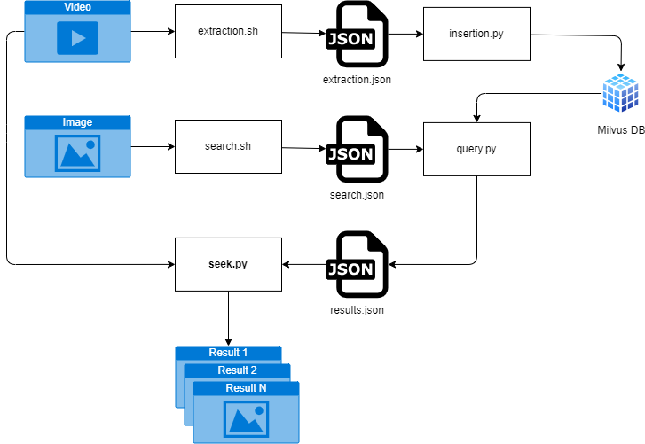

# Image Search with Intel DLStreamer and PyMilvus



## Running the environment

```ps1
docker pull docker.io/intel/dlstreamer:2024.2.2-ubuntu24
docker compose build
docker compose up -d
```

## Running pipelines

Prepare models and assets:

```bash
bash init.sh
```

Run extraction pipeline to detect objects in video:

```bash
bash extraction.sh
```

Insert the detected objects into Milvus Vector Database:

```bash
python insertion.py
```

Get embeddings for a target image (crop.jpg)

```bash
bash search.sh
```

Query the Milvus Vector Database for the target image:

```bash
python query.py
```

Find the result frames in the video:

```bash
python seek.py
```

## Development

Format and lint code:

```bash
pip install isort black pylint mdformat
isort *.py; black *.py; pylint -E *.py; mdformat README.md
```

## Links

- [Running GUI Applications in a Linux Docker Container](https://www.baeldung.com/linux/docker-container-gui-applications)
